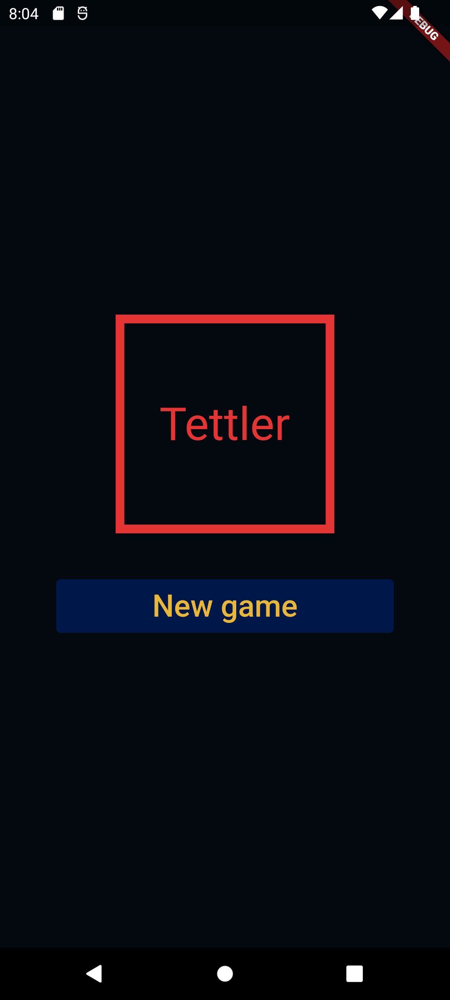
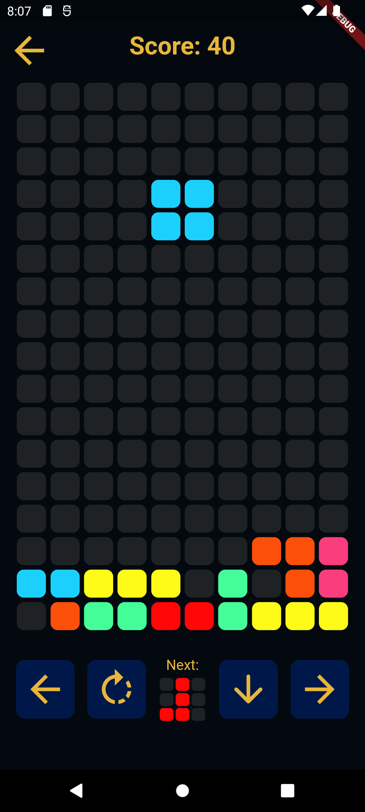

# Tetris Flutter

A Tetris game build in flutter without 3rd packages.

The game was made solely and exclusively with the flutter framework without external packages, it contains all the features of classic tetris, such as:

* Score for each line completed;
* All pieces with rotation to change position;
* Button to accelerate the descent of the piece;
* Pause, resume and new game;
* Game over if the pieces reach the top;
* Display of what will be the next piece;

## Menu

## In game

## Getting Started

This project is a starting point for a Flutter application.

A few resources to get you started if this is your first Flutter project:

- [Lab: Write your first Flutter app](https://docs.flutter.dev/get-started/codelab)
- [Cookbook: Useful Flutter samples](https://docs.flutter.dev/cookbook)

For help getting started with Flutter development, view the
[online documentation](https://docs.flutter.dev/), which offers tutorials,
samples, guidance on mobile development, and a full API reference.
